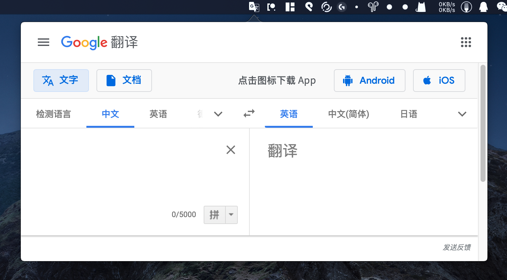
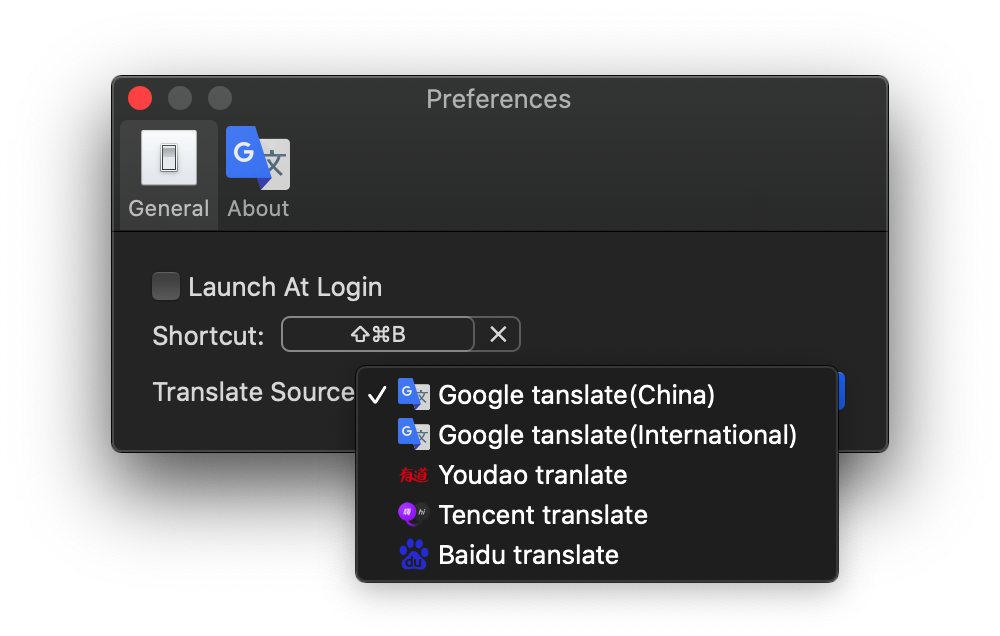

# TranslateBar

Open Google Translate easily on your menubar!

This use a `webkit view` to open `https://translate.google.cn/` .

I am in China, so it opens `.cn` instead of `.com` 

You can change to your favorite translation website if you want. 

If you lack of programming skills, tell me and I will compile a version for you !

## Screenshots:

